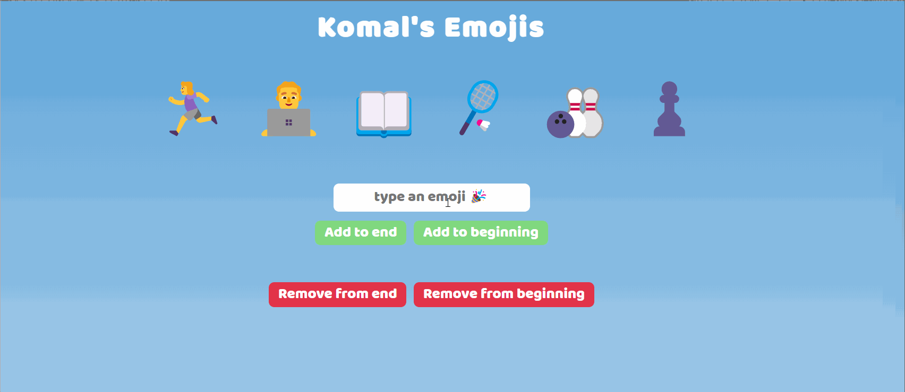

# **My Emojis**

# Overview

Welcome to My Emojis! 😊 This project is a representation of myself using emojis. The emojis showcase my favorite activities, interests, and games. Additionally, there is an input box where users can add more emojis if they wish to include additional activities. Once a user enters an emoji in the input, they can add it either to the beginning or the end of the existing emojis. Furthermore, users can also delete emojis from either the beginning or the end.

# Website

Live Version [here](https://myemojis03.netlify.app/)

# Preview

## What I've Learned

This project has provided practical experience in rendering data on the DOM, attaching event listeners to buttons, and practicing array methods such as push, unshift, shift, and pop.

## Getting Started

Explore the My Emojis by following these steps:

1. Clone the repository.
2. Open the index.html file in your browser.
3. View the existing emojis representing the creator's interests.
4. Use the input box to add your own emojis to either the beginning or the end.
5. Delete emojis from either the beginning or the end as desired.

## Features

- **Emoji Representation**: Represents the creator using emojis that showcase favorite activities and interests.

- **Dynamic Emoji Addition**: Users can add emojis to either the beginning or the end using the input box.

- **Emoji Deletion**: Remove emojis from either the beginning or the end.

# Author

Komal | Software Developer | [Portfolio](https://kaurkomal.com/) | [LinkedIn](https://www.linkedin.com/in/hssa03/)